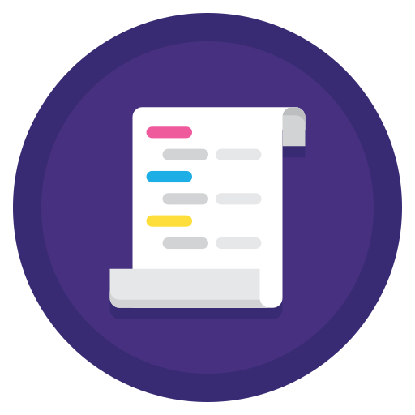

 

  
  
  <h3 align="center">Code Site Index</h3>

  

    Find your Site to learn Code in no Time
     
     
    <a href="https://github.com/fj-gruenewald/index_of_code_learning_websites/blob/main/index/code-site-index.md">Code Sites</a>
    ·
    <a href="https://github.com/fj-gruenewald/index_of_code_learning_websites/blob/main/index/code-youtube-channels.md">Code Youtube Channels</a>
    ·
    <a href="https://github.com/fj-gruenewald/index_of_code_learning_websites/blob/main/index/debug-site-index.md">Debug Sites</a>
  

  
Here you will find a large collection of sites where you can learn programming online for free or for a small price.

About courses that teach you languages, special topics or websites that help you with debugging and problems you will certainly find one or the other website here.

Wanna help make the List Complete?
Just write me a Message and become a Contributor

### Sites to learn Programming
[to the Code Site Index](https://github.com/fj-gruenewald/index_of_code_learning_websites/blob/main/index/code-site-index.md)

### Youtube Channels to learn Programming
[to the Youtube Channel Index](https://github.com/fj-gruenewald/index_of_code_learning_websites/blob/main/index/code-youtube-channels.md)

### Sites that will help you with your Errors
[to the Debug Site Index](https://github.com/fj-gruenewald/index_of_code_learning_websites/blob/main/index/debug-site-index.md)
